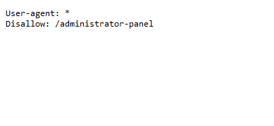

### Unprotected Admin Panel:

**Goal**: access the user panel and delete use carlos.

#### Solution:
1- Since The obvious first step is accessing the admin panel i tried add /admin, /administartion to my lab id, but this didn't work.

2- an easier way to do this is using ffuf, ffuf is a very fast fuzzing tool, and can be used for content discovery, you can use the fallowing command:

`ffuf -w PATH-TO-WORDLIST -u https://your-lab-id/FUZZ`

3-ffuf tells us that there is a robots.txt file, when checking it out we find the path to the admin panel: 

4- after fallowing the path we can access the admin panel directly and delete carlos account.

**Explanation**: Sometimes Developers many count on hidding urls to protect senstive functionalities, however these urls can be found within clint sied javascript, in robots.txt file or using content discovery tools with large wordlists.