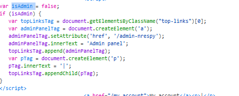

### Lab: Unprotected admin functionality with unpredictable URL

**Goal**: Access Admin Panel and delete user Carlos account

**Solution**: 

1- so this time the admin panel url is not predictable, and probable content discovery tools like ffuf wouldn't do as much here, but when  checking clinet side scripts, i find a script that checks if a user is an admin and if that true a like would be added to the application.

2- copy the link and add it to you lab domin, access the admin panel and  delete user carlos account.